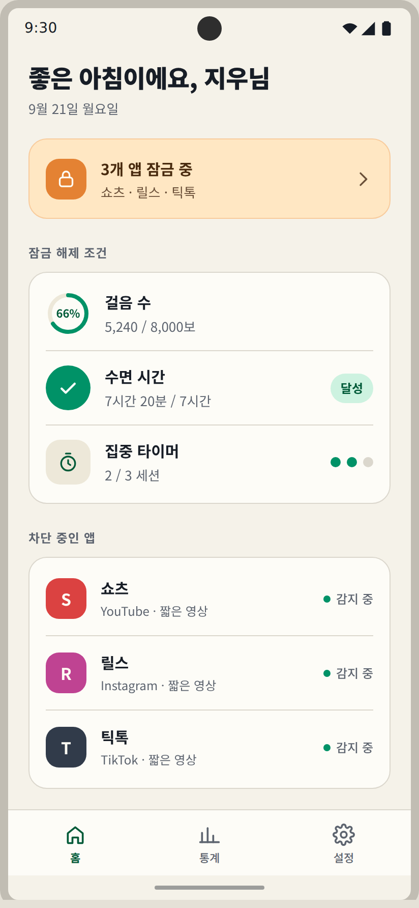
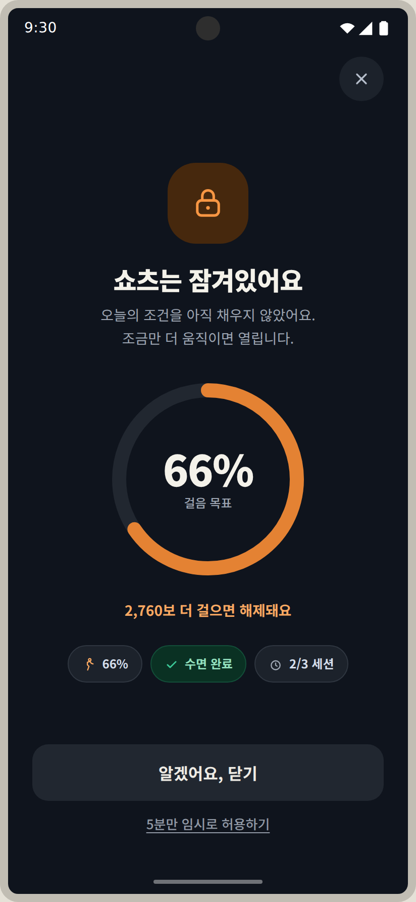
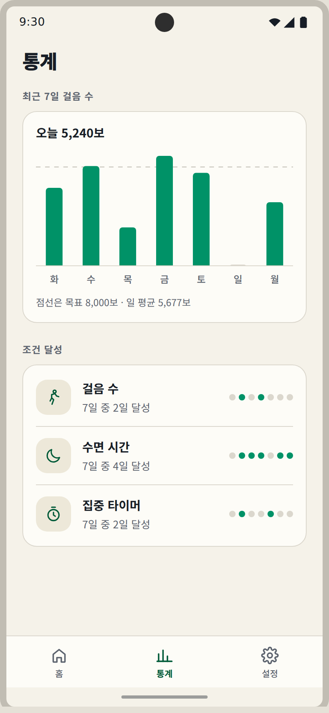
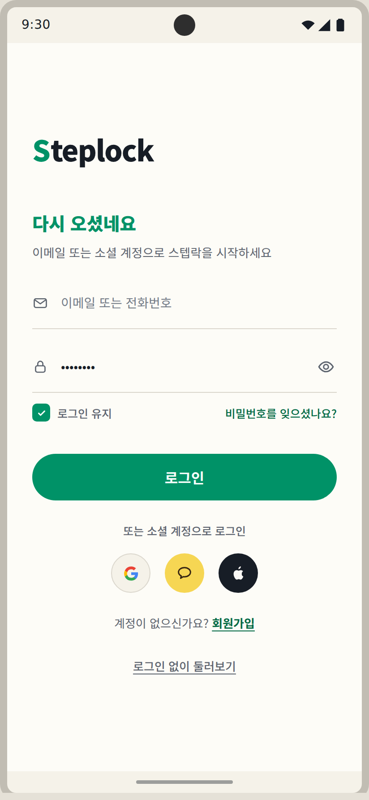
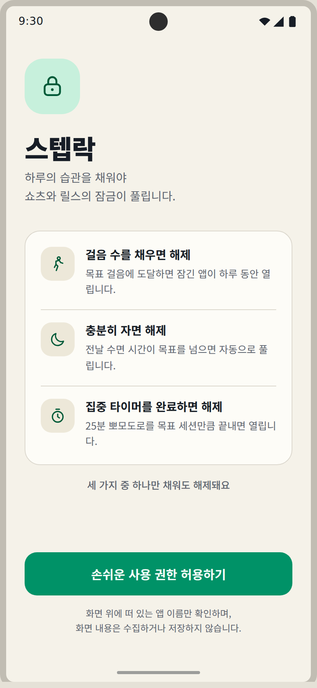
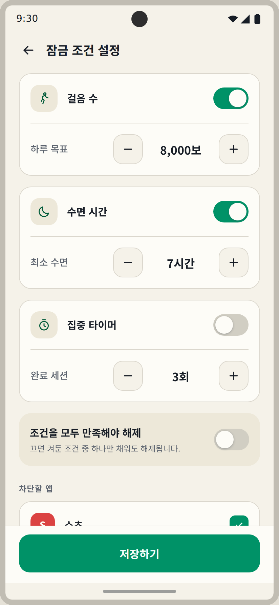
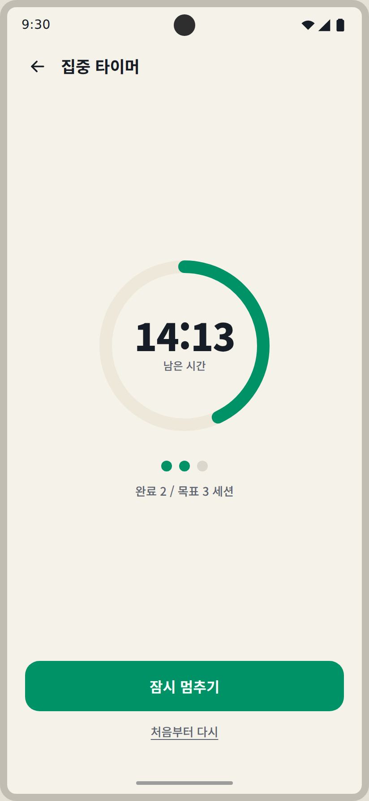

# 스텝락 (StepLock)

> 걸음 수 · 수면 시간 · 집중 타이머 중 하나를 채워야 쇼츠·릴스·틱톡의 잠금이 풀리는 습관 관리 앱.
> Kotlin + Jetpack Compose. 세 조건(걸음 수 · 수면 시간 · 집중 타이머)이 실제 데이터로 판정되고,
> **차단 앱 감지와 잠금 오버레이**까지 동작합니다.

디자인 시안(OKLCH 토큰 기반 HTML 프로토타입)을 Compose로 이식하면서, 색·간격·타이포·터치 영역을
토큰으로 정리하고 화면을 재사용 컴포저블 단위로 분리했습니다.

<p align="center">
  
  
  
</p>
<p align="center">
  
  
  
  
</p>

<p align="center"><sub>412×892 프레임 · 구현과 같은 OKLCH 토큰·간격·아이콘으로 렌더한 이미지입니다</sub></p>

---

## 화면

| 화면 | 역할 | 파일 |
| --- | --- | --- |
| **Login** | 앱 첫 화면. 밑줄형 입력 · 로그인 유지 · 소셜 3종 · 게스트 진입 | [`LoginScreen.kt`](app/src/main/java/com/steplock/app/ui/screens/LoginScreen.kt) |
| **Onboarding** | 잠금 해제 조건 3가지 안내 + 권한 3단계 요청 | [`OnboardingScreen.kt`](app/src/main/java/com/steplock/app/ui/screens/OnboardingScreen.kt) |
| **Home** | 오늘의 달성 현황, 잠금 상태 배너, 차단 중인 앱 목록 | [`HomeScreen.kt`](app/src/main/java/com/steplock/app/ui/screens/HomeScreen.kt) |
| **Settings** | 조건별 토글 + 목표값 스테퍼, 차단할 앱 선택 | [`SettingsScreen.kt`](app/src/main/java/com/steplock/app/ui/screens/SettingsScreen.kt) |
| **Lock** | 차단 앱 실행 시 덮이는 전체 화면 오버레이 (다크 팔레트) | [`LockOverlayScreen.kt`](app/src/main/java/com/steplock/app/ui/screens/LockOverlayScreen.kt) |
| **Pomodoro** | 25분 집중 세션 타이머. 홈의 집중 타이머 줄에서 진입 | [`PomodoroScreen.kt`](app/src/main/java/com/steplock/app/ui/screens/PomodoroScreen.kt) |
| **Stats** | 최근 7일 걸음 막대 차트와 조건별 달성 일수 | [`StatsScreen.kt`](app/src/main/java/com/steplock/app/ui/screens/StatsScreen.kt) |

화면 이동: `Login → Onboarding → Home`, 홈에서 설정 · 집중 타이머 · 잠금 오버레이로 들어갑니다.
하단 탭은 홈 · 통계 · 설정이고, 온보딩을 마친 기기는 다음 실행부터 로그인을 건너뛰고 홈에서 시작합니다.

각 화면 파일 하단에 `@Preview`가 있어 Android Studio에서 412×892 프레임으로 바로 확인할 수 있습니다.
위 이미지는 [`docs/screens/`](docs/screens)에 있습니다.

---

## 잠금은 이렇게 동작합니다

1. `AppWatchService`(포그라운드 서비스)가 1초 간격으로 `UsageStatsManager`의 이벤트를 읽어
   전경 앱을 확인합니다.
2. 전경 앱이 차단 목록에 있으면 `UnlockEvaluator`로 오늘 조건을 판정합니다.
   전부 만족 모드가 꺼져 있으면 켜 둔 조건 중 하나만 채워도 통과합니다.
3. 조건 미달이면 `LockActivity`를 띄웁니다. 닫기와 뒤로 가기는 홈으로 보내고,
   "5분만 임시로 허용하기"를 누르면 그 시간만 감시를 쉽니다.

걸음 수는 `TYPE_STEP_COUNTER`의 부팅 후 누적값에서 그날 첫 값을 기준점으로 빼 계산하고,
기준점은 DataStore에 날짜와 함께 저장합니다. 재부팅으로 누적값이 줄면 기준점을 다시 잡습니다.

수면은 Health Connect의 `SleepSessionRecord`를 지난 24시간 창으로 읽어 분으로 합칩니다.
세션을 창에 맞춰 잘라 더하므로 자정을 넘긴 수면도 한 번만 셉니다. 매초 조회할 수는 없으니
읽은 값은 DataStore에 캐시하고, 앱을 열 때와 감시 서비스가 10분마다 갱신합니다.
권한은 온보딩을 막지 않고 **설정에서 수면 조건을 켤 때** 요청합니다 — Health Connect가 없거나
거절하면 조건이 켜지지 않고 이유를 알려 줍니다.

집중 세션은 남은 시간이 아니라 **종료 시각**을 저장합니다. 그래서 앱이나 서비스가 죽어도
남은 시간을 다시 계산할 수 있고, 시간이 지난 세션은 앱을 여는 순간 집계됩니다.
멈춘 세션만 남은 시간으로 보관합니다. 완료 세션은 날짜와 함께 쌓여 자정에 0으로 돌아가고,
`UnlockEvaluator`의 집중 타이머 조건에 그대로 쓰입니다.

**감지 방식 선택** — 접근성 서비스가 더 빠르고 정확하지만 Play 스토어에서 민감 권한으로 분류돼
심사 설명을 요구합니다. 그래서 심사 부담이 작은 사용 정보 접근(`PACKAGE_USAGE_STATS`) +
화면 위 표시(`SYSTEM_ALERT_WINDOW`) 조합을 택했습니다. 대신 폴링이라 감지가 1초 정도 늦습니다.

필요한 권한은 세 가지이고, 온보딩 CTA가 남은 권한 하나씩만 순서대로 요구합니다.

| 권한 | 용도 |
| --- | --- |
| `ACTIVITY_RECOGNITION` | 걸음 수 센서 읽기 (런타임 권한) |
| 사용 정보 접근 | 전경 앱 확인 (설정 화면에서 허용) |
| 화면 위 표시 | 다른 앱 위에 잠금 화면 띄우기 (설정 화면에서 허용) |

수면 읽기(`health.READ_SLEEP`)는 선택 권한이라 이 흐름에 넣지 않고, 수면 조건을 켤 때만 묻습니다.

---

## 디자인 시스템

### 색상 — OKLCH로 설계, sRGB로 변환

시안은 OKLCH로 정의했고 Compose에서 쓸 수 있도록 sRGB로 변환했습니다.
원본 토큰은 [`Color.kt`](app/src/main/java/com/steplock/app/ui/theme/Color.kt)에 주석으로 남겨
두어 시안과 대조할 수 있습니다.

| 역할 | OKLCH | sRGB |
| --- | --- | --- |
| 배경 | `oklch(96% 0.012 90)` | `#F5F2E9` |
| 서피스 | `oklch(99% 0.006 90)` | `#FDFCF7` |
| 서피스(보조) | `oklch(93% 0.02 90)` | `#EDE8D9` |
| 보더 | `oklch(88% 0.015 90)` | `#DBD7CD` |
| 본문 | `oklch(23% 0.02 260)` | `#171D26` |
| 보조 텍스트 | `oklch(50% 0.02 260)` | `#5D646F` |
| 브랜드(그린) | `oklch(58% 0.13 165)` | `#009267` |
| 브랜드(진한톤) | `oklch(40% 0.115 165)` | `#005A38` |
| 강조(앰버·잠금) | `oklch(70% 0.15 55)` | `#E48233` |
| 다크 배경 | `oklch(19% 0.02 260)` | `#0F141D` |
| 다크 서피스 | `oklch(25% 0.02 260)` | `#1C222B` |

- 배경은 순수 흰색·검정 대신 브랜드 색이 은은하게 섞인 **틴티드 뉴트럴**을 씁니다.
- 다크 팔레트는 **잠금 오버레이 전용**이라 시스템 다크모드를 따라가지 않습니다.
- 앱 뱃지(쇼츠·릴스·틱톡·엑스)와 소셜 아이콘만 식별 목적으로 각 브랜드 색을 유지합니다.

### 타이포그래피

Noto Sans KR 400/500/700/900. 화면에서 쓰는 스타일을 [`Type.kt`](app/src/main/java/com/steplock/app/ui/theme/Type.kt)에
의미 단위로 모아 두고(`SlText.Greeting`, `SlText.RowTitle` …) `includeFontPadding = false`로
시안의 행간을 맞췄습니다. 폰트는 다운로더블 폰트로 받아오며, ttf를 번들하려면
`res/font`에 넣고 `NotoSansKr` 정의만 교체하면 됩니다.

### 간격 · 형태 · 접근성

- 간격은 **4dp 그리드**(4 · 8 · 12 · 16 · 20 · 24 · 28 · 32)만 사용합니다.
- 라운드는 14~20dp, CTA는 16dp, 로그인 버튼과 칩은 캡슐형입니다.
- 카드를 겹치지 않고 하나의 패널 안에서 구분선과 여백으로 섹션을 나눕니다(`SlPanel`).
- 모든 탭 영역은 **44dp 이상**입니다. 스위치·체크박스·텍스트 링크도 시각 크기와 별개로
  터치 영역을 44dp로 확보했습니다.
- 아이콘은 이모지·비트맵 없이 stroke 벡터로 직접 그렸습니다
  ([`SlIcons.kt`](app/src/main/java/com/steplock/app/ui/components/SlIcons.kt)).
- 문구는 동작을 알 수 있게 씁니다 — "손쉬운 사용 권한 허용하기", "알겠어요, 닫기",
  "로그인 없이 둘러보기".
- 한국어 조사 처리: 잠금 화면 제목은 받침에 따라 은/는을 붙입니다("쇼츠는", "틱톡은").

---

## 재사용 컴포저블

| 컴포저블 | 설명 |
| --- | --- |
| `ProgressRing` | 홈 44dp · 잠금 200dp 공용 원형 게이지. 박스 크기와 링 반지름을 따로 받습니다. |
| `ConditionRow` | 홈의 조건 한 줄. 앞쪽 시각 요소와 뒤쪽 상태를 슬롯으로 받습니다. |
| `ConditionSettingCard` | 토글 + 구분선 + `GoalStepper` 조합. 설정의 조건 카드 3개. |
| `GoalStepper` | −/+ 44dp 버튼과 목표값. 걸음 500보 · 수면 30분 · 세션 1회 단위. |
| `AppListItem` | 앱 뱃지 + 이름/부제 + 상태 슬롯(감지 중 점 / 체크박스). |
| `LockBanner` | 앰버 톤 잠금 상태 배너. 탭하면 설정으로 이동합니다. |
| `StatusChip` | 잠금 화면 미니 상태 칩. 달성 / 진행 중 / 미시작 3상태. |
| `UnderlineTextField` | 밑줄형 입력. 포커스 시 밑줄이 브랜드 그린, 비밀번호는 표시 토글 내장. |
| `SocialLoginButton` | 구글 · 카카오 · 애플 44dp 원형 버튼. |
| `SlSwitch` · `CheckboxMark` | 시안 규격(52×32 트랙, 24dp 체크박스)에 맞춘 선택 컨트롤. |
| `BottomNavBar` | 홈 · 통계 · 설정 탭. 라벨 표시를 끌 수 있습니다. |
| `WeeklyBarChart` | 일별 막대 하나에 값 하나. 영점에서 시작하고 목표는 점선으로만 표시합니다. |
| `SlPanel` · `SectionLabel` · `PrimaryButton` · `TextLink` · `IconTile` · `AppBadge` | 공통 레이아웃 조각. |

---

## 데이터 · 상태 설계

로그인 전에도 기기별로 기록이 쌓이고, 로그인 후 서버 계정에 귀속시킬 수 있도록 모델을 잡았습니다
([`Models.kt`](app/src/main/java/com/steplock/app/data/Models.kt)).

- `LockSettings` · `DailyStat` — `deviceUuid: String`과 `accountId: String?`를 함께 보관.
  로그인 성공 시 `deviceUuid` 레코드를 계정에 귀속(claim)시키는 마이그레이션 훅용입니다.
- `AuthState` — `Unknown` · `Guest` · `SignedIn(accountId)`.
- `SettingsRepository` — DataStore Preferences에 목표값·조건 토글·차단 앱·기기 UUID·온보딩 완료
  여부와 걸음 기준점·수면 분·집중 세션을 저장하고 `Flow<AppPreferences>`로 흘려보냅니다.
- `StepTracker` · `SleepRepository` — 센서와 Health Connect에서 오늘의 값을 만듭니다.
- 일별 이력 — 통계용으로 하루 한 줄(`날짜|걸음|수면분|세션`)씩 최근 30일만 DataStore에 남깁니다.
  주·월 단위 집계까지 가면 Room으로 옮기는 게 맞습니다.
- `StepLockViewModel` — 저장된 설정과 센서 걸음 수를 합쳐 `StateFlow<StepLockUiState?>`로 냅니다.
  설정에서 걸음 목표를 바꾸면 홈 게이지와 잠금 화면 문구가 함께 갱신됩니다.

---

## 기술 스택

- Kotlin 2.0 · Jetpack Compose (Material 3) · Navigation Compose
- DataStore Preferences · SensorManager · Health Connect · UsageStatsManager · 포그라운드 서비스
- Gradle KTS + 버전 카탈로그 (`gradle/libs.versions.toml`)
- minSdk 26 / targetSdk 35 · edge-to-edge

```
app/src/main/java/com/steplock/app
├── MainActivity.kt
├── data/            # 모델 · SettingsRepository(DataStore) · StepTracker · UnlockEvaluator
├── navigation/      # Route · StepLockNavHost
├── service/         # AppWatchService(전경 앱 감시) · PomodoroService(집중 세션)
├── system/          # 권한 확인과 설정 화면 인텐트
└── ui/
    ├── LockActivity.kt
    ├── components/  # 재사용 컴포저블 + stroke 아이콘 세트
    ├── screens/     # 5개 화면
    ├── theme/       # 색 · 타이포 · 치수 토큰
    └── util/        # 숫자·시간·조사 포맷
```

## 실행

```bash
./gradlew assembleDebug
```

Android Studio에서 열면 각 화면의 `@Preview`로 레이아웃을 바로 볼 수 있습니다.

## 구현 범위

동작하는 것 — 일곱 화면, 설정 영구 저장, 세 조건 모두(걸음 수 센서 · Health Connect 수면 ·
25분 집중 세션), 차단 앱 감지와 잠금 오버레이, 조건 판정(하나만 / 전부 만족), 임시 허용 5분,
최근 7일 통계.

아직 연결하지 않은 것:

- **실제 인증** — 로그인 화면은 레이아웃과 상태까지입니다. Firebase Auth·소셜 SDK 미연결.
- **재부팅 후 자동 시작** — 지금은 앱을 한 번 열면 감시 서비스가 다시 붙습니다.

쇼츠·릴스는 각각 YouTube·Instagram 앱 안에 있어 앱 단위로 잠깁니다.
짧은 영상 화면만 골라 잠그려면 접근성 서비스로 화면 단위를 봐야 합니다.
