# 스텝락 (StepLock)

[](https://github.com/kangjungmook/StepLock_App/actions/workflows/build-apk.yml)

> 걸음 수 · 수면 시간 · 집중 타이머 중 하나를 채워야 내가 고른 앱의 잠금이 풀리는 습관 관리 앱.
> Kotlin + Jetpack Compose. 세 조건(걸음 수 · 수면 시간 · 집중 타이머)이 실제 데이터로 판정되고,
> **차단 앱 감지와 잠금 오버레이**까지 동작합니다.

디자인 시안(OKLCH 토큰 기반 HTML 프로토타입)을 Compose로 이식하면서, 색·간격·타이포·터치 영역을
토큰으로 정리하고 화면을 재사용 컴포저블 단위로 분리했습니다.

<p align="center">
  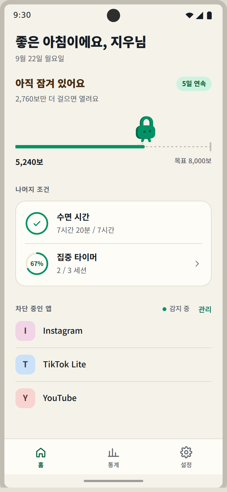
  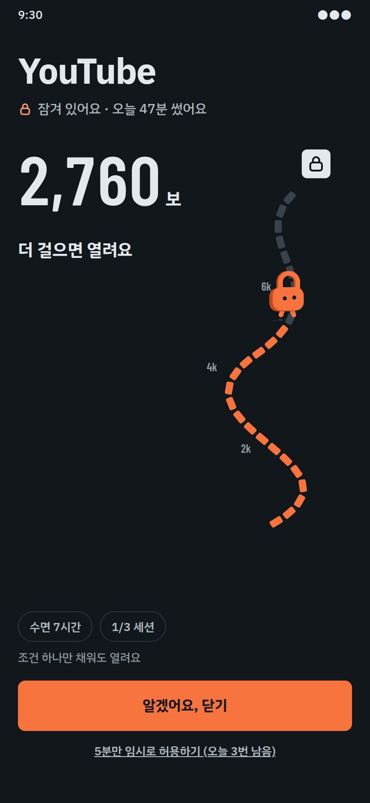
  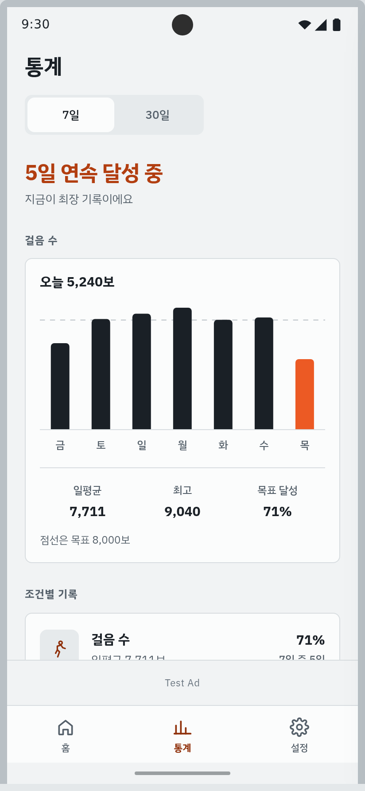
</p>
<p align="center">
  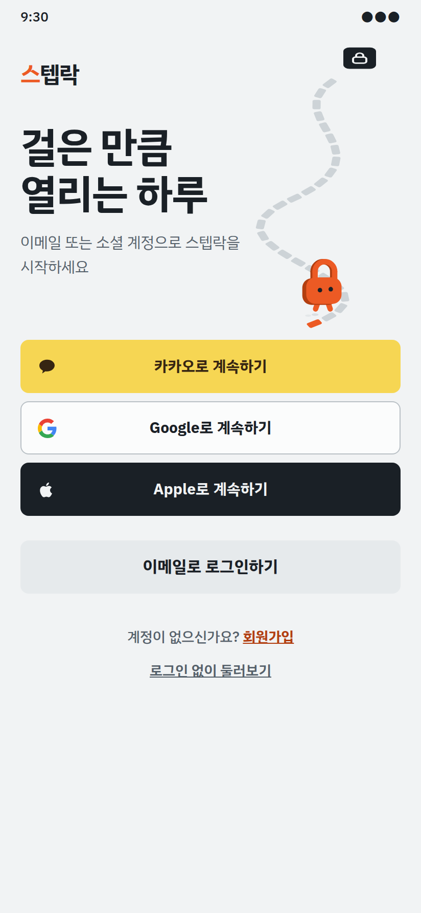
  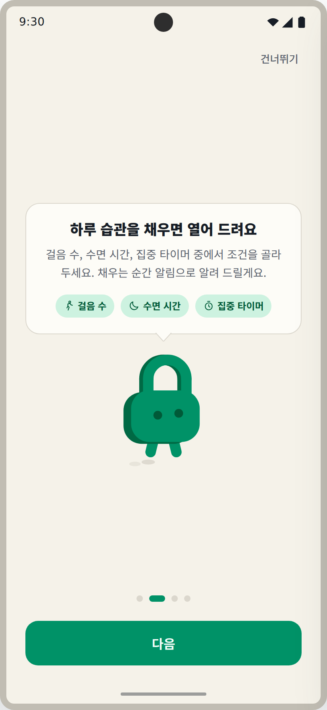
  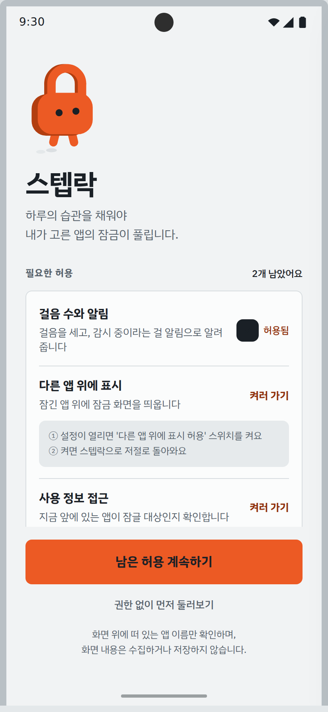
  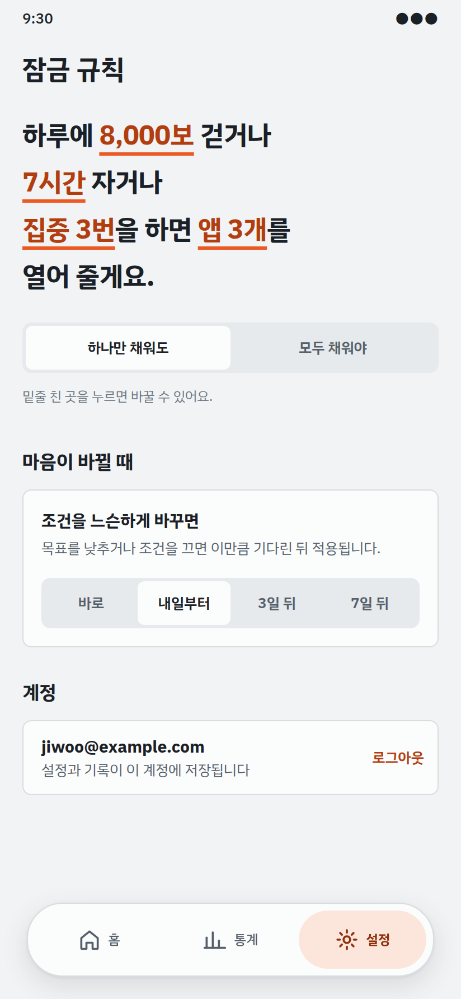
</p>
<p align="center">
  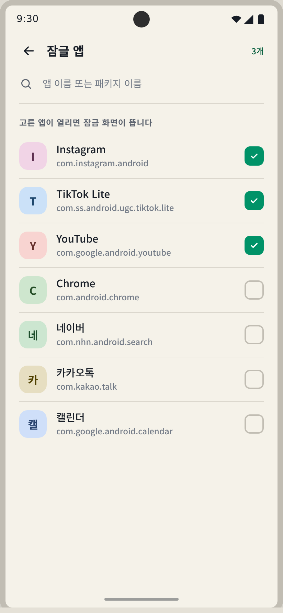
  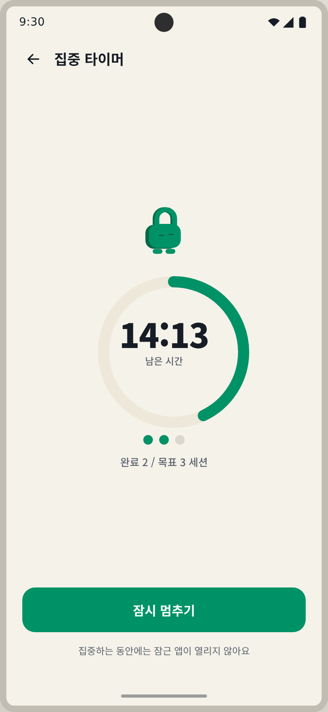
</p>

<p align="center"><sub>412×892 프레임 · 구현과 같은 OKLCH 토큰·간격·아이콘으로 렌더한 이미지입니다 (실기기 캡처가 아닙니다).<br>앱 아이콘 자리는 첫 글자 자리표시자이며, 실제 앱은 기기에 깔린 각 앱의 아이콘을 보여 줍니다</sub></p>

## 캐릭터 — 스텝이

<p align="center">
  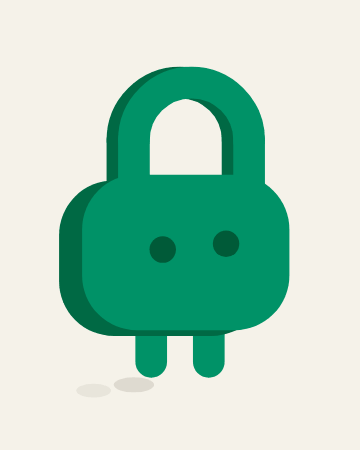
</p>

<p align="center">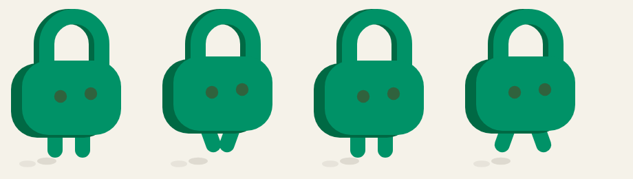</p>

이름 그대로 걸어서 잠금을 푸는 앱이라, 다리가 달린 자물쇠 **스텝이**를 마스코트로 씁니다.
스텝이는 앱 곳곳에서 직접 말합니다.

| 자리 | 스텝이의 말 |
| --- | --- |
| 첫 실행 튜토리얼 | "안녕하세요, 저는 스텝이예요" — 네 장에 나눠 앱 쓰는 법을 알려 줍니다 |
| 잠금 화면 | 옆에서 말풍선으로 "2,760보만 더 걸으면 열려요" |
| 집중 타이머 | "집중하는 동안 잠근 앱은 제가 지킬게요. 끝날 때까지 멈추지 않아요" (도는 중·쉬는 중·목표 달성·잠근 앱 없음마다 다름) |
| 알림 | 머리글에 "스텝이"가 붙고, "해냈어요! 오늘은 열어 둘게요", 저녁 7~10시 "저녁 산책 같이 가요?" |
| 빈 화면 | "지킬 앱을 골라 주세요 — 고른 앱이 열리면 제가 막아 둘게요" |

말풍선(`StepiBubble`)은 **캐릭터가 바로 옆에 있는 자리에서만** 씁니다. 캐릭터 없이 말풍선만
있으면 테두리 있는 상자가 하나 더 생길 뿐이라, 빈 화면처럼 패널 안에 캐릭터가 이미 있는
곳은 말투만 바꿨습니다.
런처 아이콘은 이 캐릭터를 적응형 아이콘(전경 PNG + 크림 배경 + 모노크롬 벡터)으로 넣었습니다.

앱 안에서는 비트맵을 쓰지 않고 100×124 좌표계로 **다시 그려**
([`StepLockMascot.kt`](app/src/main/java/com/steplock/app/ui/components/StepLockMascot.kt))
캔버스로 움직입니다. 어떤 크기에서도 선명하고, 색은 팔레트 토큰을 그대로 받습니다.

**자세가 상태를 말합니다** — 글자를 읽지 않아도 지금 어떤 상태인지 보이게.

| 자세 | 뜻 | 움직임 |
| --- | --- | --- |
| `Walking` | 목표까지 남음 | 다리 스윙 + 상하 반동, 900ms |
| `Resting` | 달성 · 대기 | **완전 정지.** 애니메이션 값을 읽지 않습니다 |
| `Focusing` | 집중 세션 진행 중 | 앉은 자세, 숨결만 2600ms 왕복 |

`Resting`이 값을 아예 읽지 않는 건 의도입니다 — 멈춘 상태에 미세한 움직임이 남으면 그게 더
눈에 걸리고, 매 프레임 다시 그리게 됩니다.

쓰는 자리는 일곱 곳입니다. 로그인·설정·차트 안·달성 축하 연출에는 **넣지 않았습니다**
(기준은 [DESIGN.md 4-4절](DESIGN.md)).

| 자리 | 크기 | 자세 |
| --- | --- | --- |
| 온보딩 | 96×119dp | 걸어 들어오는 첫 화면 |
| 홈 (`StepTrack` 위) | 44×55dp | 진행률을 **위치**로 — 걷다가 달성하면 멈춰 섭니다 |
| 잠금 | 80×99dp | 어두운 배경용 그린. 아직 걷고 있다는 게 곧 아직 못 열었다는 뜻 |
| 집중 타이머 | 56×69dp | 세션이 도는 동안 함께 앉아 있습니다 |
| 빈 상태 | 36×45dp | 빈 화면이 고장처럼 보이지 않게 |
| 스플래시 | 288×288 벡터 | 앱을 켤 때 (정지) |
| 앱 · 알림 아이콘 | 적응형 / 24dp | 자물쇠 기호 (캐릭터가 아님) |

---

## 화면

| 화면 | 역할 | 파일 |
| --- | --- | --- |
| **Login** | 앱 첫 화면. 밑줄형 입력 · 비밀번호 재설정 · 소셜 3종 · 게스트 진입 | [`LoginScreen.kt`](app/src/main/java/com/steplock/app/ui/screens/LoginScreen.kt) |
| **Sign Up** | 이메일 가입. 비밀번호 확인 · 개인정보 처리방침 동의 · 인증 메일을 보냈으면 "메일함을 확인해 주세요" | [`SignUpScreen.kt`](app/src/main/java/com/steplock/app/ui/screens/SignUpScreen.kt) |
| **Tutorial** | 첫 실행 안내 네 장. 스텝이가 말풍선으로 한 장에 한 가지씩 — 인사 · 해제 조건 · 5분 허용 · 권한 | [`TutorialScreen.kt`](app/src/main/java/com/steplock/app/ui/screens/TutorialScreen.kt) |
| **Onboarding** | 필요한 권한 세 줄을 한 화면에(남은 개수 표시). 설정에서만 켜는 두 줄은 무엇을 켜면 되는지 안내하고, 켜는 순간 앱으로 저절로 돌아옴. 권한 없이 먼저 둘러보기 | [`OnboardingScreen.kt`](app/src/main/java/com/steplock/app/ui/screens/OnboardingScreen.kt) |
| **Home** | 지금 상태를 한 문장으로, 그 아래 오늘의 숫자 · 최근 7일 링 · 앱별 오늘 막은 횟수 (아래 "홈" 절) | [`HomeScreen.kt`](app/src/main/java/com/steplock/app/ui/screens/HomeScreen.kt) |
| **Settings** | 해제 조건(한 패널), 잠글 앱 고르기, 완화 대기 기간, 계정, 화면 모드(기기 설정 · 라이트 · 다크), 사용 방법 다시 보기 | [`SettingsScreen.kt`](app/src/main/java/com/steplock/app/ui/screens/SettingsScreen.kt) |
| **App Picker** | 기기에 깔린 앱에서 잠글 앱 고르기. 검색, 고른 앱 먼저, 해제 대기 중인 앱 표시 | [`AppPickerScreen.kt`](app/src/main/java/com/steplock/app/ui/screens/AppPickerScreen.kt) |
| **Lock** | 차단 앱 실행 시 덮이는 전체 화면 오버레이. 켜 둔 조건 하나만 링으로 크게, 나머지는 칩으로 (다크 팔레트) | [`LockOverlayScreen.kt`](app/src/main/java/com/steplock/app/ui/screens/LockOverlayScreen.kt) |
| **Pomodoro** | 25분 집중 세션. 앱을 잠그는 순간 저절로 시작되고 **끝날 때까지 멈출 수 없습니다** | [`PomodoroScreen.kt`](app/src/main/java/com/steplock/app/ui/screens/PomodoroScreen.kt) |
| **Stats** | 7일 / 30일 전환, 걸음 차트와 요약 3칸, 조건별 일평균과 달성률 | [`StatsScreen.kt`](app/src/main/java/com/steplock/app/ui/screens/StatsScreen.kt) |

화면 이동: `Login(→ Sign Up) → Tutorial → Onboarding → Home`, 홈에서 집중 타이머 · 잠글 앱 고르기로 들어갑니다.
잠금 화면은 감시 서비스가 차단 앱 위에 띄우며, 집중 중이면 거기서 타이머로 바로 넘어갈 수 있습니다.
하단 탭은 홈 · 통계 · 설정이고 세 화면 모두에 보입니다. 탭은 홈 위에 하나만 쌓여서 어느 탭에서든
뒤로 가기 한 번이면 홈입니다. 온보딩을 마친 기기는 다음 실행부터 로그인을 건너뛰고 홈에서 시작합니다.

**잠근 앱이 없으면 아무것도 진행하지 않습니다.** 홈은 "아직 막고 있는 앱이 없어요"와 잠글 앱 고르기
버튼, 앱을 잠그면 채울 조건의 목표만 보여 줍니다 — 진행 링·트랙은 앱을 잠근 뒤에 나타납니다.
걸음은 만보기처럼 하루 동안 계속 세므로, 오후에 앱을 잠가도 그날 아침부터 걸은 걸음이 들어갑니다.

각 화면 파일 하단에 `@Preview`가 있어 Android Studio에서 412×892 프레임으로 바로 확인할 수 있습니다.
위 이미지는 [`docs/screens/`](docs/screens)에 있습니다.

### 홈

<p align="center">
  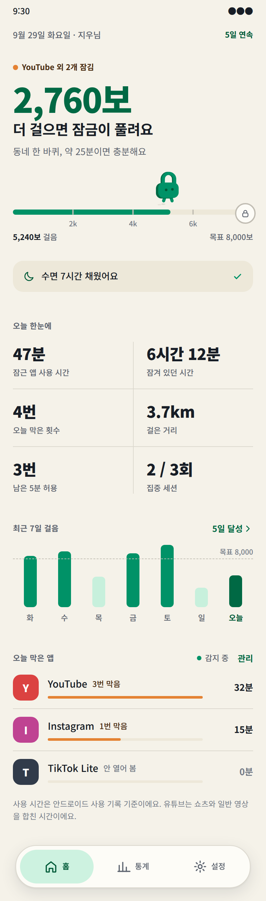
  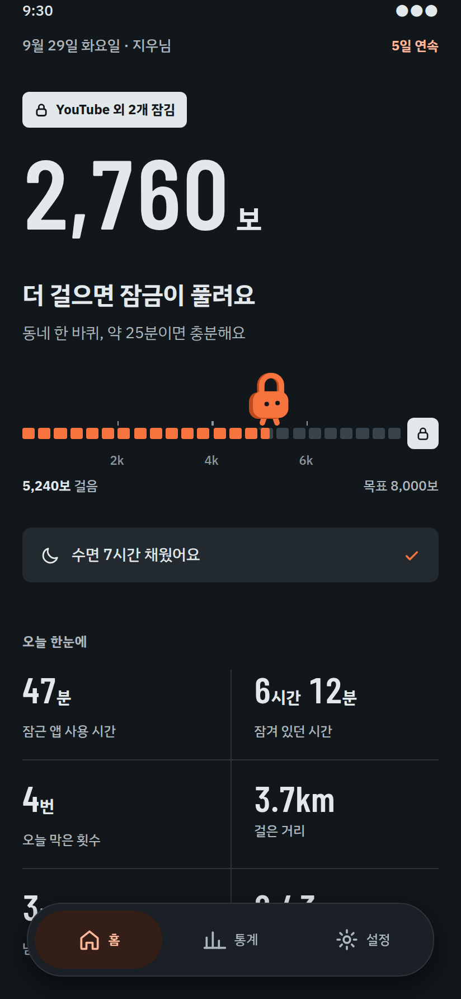
</p>

**할 일의 양을 가장 크게** 말합니다. 화면을 연 사람이 가장 알고 싶은 건 "얼마나 더"라서,
문장 속에 묻혀 있던 숫자를 떼어 52sp로 올렸습니다. 위에서 아래로 *지금 → 길 → 오늘 → 최근 → 대상*.

| 구역 | 보여 주는 것 |
| --- | --- |
| 지금 | "YouTube 외 2개 잠김"(점 하나와 글자) → 큰 숫자 **2,760보** → "더 걸으면 잠금이 풀려요" → "동네 한 바퀴, 약 25분이면 충분해요"(분당 약 100보로 어림) |
| 길 | 굵은 길 위를 스텝이가 걷고, 끝에는 자물쇠. 걸음 조건이면 목표를 4등분한 이정표(2k · 4k · 6k) |
| 나머지 조건 | 옅은 띠 한 줄씩 — "수면 7시간 채웠어요 ✓", 못 채웠으면 "5시간 / 7시간". 집중 타이머 띠는 누르면 타이머로 |
| 오늘 한눈에 | 2×3 숫자 — **잠근 앱 사용 시간 · 잠겨 있던 시간**을 맨 앞에, 그 아래 오늘 막은 횟수 · 걸은 거리 · 남은 5분 허용 · 집중 세션(집중 조건이 꺼져 있으면 최근 7일 달성) |
| 최근 7일 걸음 | 걸음 막대와 목표 점선. 채운 날은 진한 초록, 못 채운 날은 옅은 초록, 오늘은 가장 진하게. 누르면 통계로 |
| 오늘 막은 앱 | 앱마다 오늘 쓴 시간(오른쪽 숫자)과 그만큼 차는 앰버 막대, 이름 옆에 막은 횟수. 오래 쓴 앱이 위로 |

카드를 쌓지 않습니다. 구역은 44dp 여백과 섹션 제목으로 나누고, 면을 까는 건 "나머지 조건" 띠뿐입니다.
하단 탭은 화면에서 띄운 알약(좌우 24dp, 아래 12dp)이고 세 탭 모두 이름이 보입니다. 내용은 탭
뒤로 흐르고, 스크롤 끝에는 탭에 가리지 않게 여백을 둡니다.

막은 횟수는 감시 서비스가 잠금 화면을 띄울 때 앱별로 기록합니다. 기기에만 두고 날짜가 바뀌면
새로 셉니다. 같은 앱에 머무는 동안은 잠금을 다시 띄우지 않으므로 "그 앱을 열려고 한 횟수"에
가깝습니다.

---

## 잠금은 이렇게 동작합니다

1. `AppWatchService`(포그라운드 서비스)가 1초 간격으로 `UsageStatsManager`의 이벤트를 읽어
   전경 앱을 확인합니다.
2. 전경 앱이 차단 목록에 있으면 `UnlockEvaluator`로 오늘 조건을 판정합니다.
   전부 만족 모드가 꺼져 있으면 켜 둔 조건 중 하나만 채워도 통과합니다.
3. 조건 미달이면 `LockActivity`를 띄웁니다. 닫기와 뒤로 가기는 홈으로 보내고,
   "5분만 임시로 허용하기"를 누르면 그 시간만 감시를 쉽니다.

재부팅하면 서비스가 사라지므로 `BootReceiver`가 다시 띄웁니다. `BOOT_COMPLETED`는
포그라운드 서비스 시작이 허용되는 예외라 별도 우회 없이 동작합니다.

걸음 수는 만보기 앱들이 쓰는 `TYPE_STEP_COUNTER` 센서로 셉니다. 센서는 부팅 후 누적값을 주므로
날짜별 기준점을 두고 `오늘 걸음 = 이어 붙인 값 + (지금 누적 − 기준 누적)`으로 계산합니다
([`StepCounting.kt`](app/src/main/java/com/steplock/app/data/StepCounting.kt)).

- **재부팅해도 오늘 걸음이 0으로 돌아가지 않습니다.** 센서는 재부팅하면 0부터 다시 세는데,
  그 전까지 센 오늘 걸음(1분마다 기록)을 이어 붙입니다. 재부팅은 부팅 횟수
  (`Settings.Global.BOOT_COUNT`)로 알아챕니다 — 누적값이 줄었는지만 보면 재부팅 뒤 기준보다
  많이 걸은 다음에 읽었을 때 놓칩니다.
- 폰을 **오늘 켰다면** 센서 숫자가 전부 오늘 걸음이라 그대로 셉니다.
- 기준점 읽기 · 판단 · 쓰기는 DataStore `edit` 한 번 안에서 합니다. 화면과 감시 서비스가
  각자 센서를 읽어도 기준점을 두 번 잡지 않습니다.
- 센서는 **누군가 듣고 있는 동안에만** 셉니다. 앱 화면을 닫아도 세는 것은 감시 서비스가 늘
  듣고 있기 때문입니다.
- 이 규칙은 기기에서 재현하기 어려워 단위 테스트로 확인합니다
  ([`StepCountingTest.kt`](app/src/test/java/com/steplock/app/data/StepCountingTest.kt), CI `unit-tests` 잡).

수면은 Health Connect의 `SleepSessionRecord`를 지난 24시간 창으로 읽어 분으로 합칩니다.
세션을 창에 맞춰 잘라 더하므로 자정을 넘긴 수면도 한 번만 셉니다. 매초 조회할 수는 없으니
읽은 값은 DataStore에 캐시하고, 앱을 열 때와 감시 서비스가 10분마다 갱신합니다.
권한은 온보딩을 막지 않고 **설정에서 수면 조건을 켤 때** 요청합니다 — Health Connect가 없거나
거절하면 조건이 켜지지 않고 이유를 알려 줍니다.

집중 세션은 남은 시간이 아니라 **종료 시각**을 저장합니다. 그래서 앱이나 서비스가 죽어도
남은 시간을 다시 계산할 수 있고, 끝난 세션은 감시 서비스(1초 간격)나 앱이 집계합니다.
완료 세션은 **끝난 날**의 몫으로 쌓여 자정에 0으로 돌아가고, `UnlockEvaluator`의 집중 타이머
조건에 그대로 쓰입니다.

**집중 세션은 저절로 시작되고, 시작하면 멈출 수 없습니다.** 집중 조건을 켜 두고 오늘 목표가
남았을 때 다음 순간에 25분 세션이 시작됩니다.

| 시작되는 순간 | 어디서 |
| --- | --- |
| 잠글 앱을 고를 때 | 앱 고르기 화면 — 누르기 전에 "앱을 잠그면 25분 집중이 바로 시작돼요"를 먼저 보여 줍니다 |
| 잠근 앱이 있는 채로 집중 조건을 켤 때 | 설정 — 조건 패널 아래에 같은 규칙을 적어 둡니다 |
| 잠금 화면이 뜰 때 | 감시 서비스 — 다음 날이나 세션 사이에 잠근 앱을 열면 다음 세션이 시작됩니다 |

세션은 한 번에 하나만 돌고, 끝나면 다음 세션은 잠근 앱을 다시 열 때 시작됩니다(세션 사이 쉬는 시간).
바로 이어 가고 싶으면 타이머 화면의 "다음 25분 바로 시작하기"를 누릅니다.

도는 동안에는 앱 안에서 끝낼 길을 모두 닫았습니다 — 멈춤·처음부터 버튼이 없고, 5분 임시 허용이
듣지 않고, 잠근 앱을 목록에서 뺄 수 없고, 계정 삭제도 숨깁니다(지우면 잠근 앱 목록까지 사라져
뒷문이 됩니다). 새 앱을 더 잠그는 것은 됩니다.

남겨 둔 출구는 둘입니다. **앱 삭제**는 저장소가 통째로 사라집니다. **시스템 설정의 강제 종료**는
저장소를 남기므로, 다음에 앱이 뜰 때 안드로이드의 프로세스 종료 기록(`ApplicationExitInfo`,
Android 11+)을 보고 "세션 도중 사용자가 끝냈다"면 세션을 집계하지 않고 지웁니다(`ForceStopCheck`).
Android 10 이하에는 이 기록이 없어 세션이 원래 끝나는 시각까지 이어집니다. 일부 제조사 기기는
최근 앱 목록에서 밀어 닫는 것도 같은 사유로 기록할 수 있습니다.

**감지 방식 선택** — 접근성 서비스가 더 빠르고 정확하지만 Play 스토어에서 민감 권한으로 분류돼
심사 설명을 요구합니다. 그래서 심사 부담이 작은 사용 정보 접근(`PACKAGE_USAGE_STATS`) +
화면 위 표시(`SYSTEM_ALERT_WINDOW`) 조합을 택했습니다. 대신 폴링이라 감지가 1초 정도 늦습니다.

필요한 권한은 세 가지입니다. 온보딩은 세 줄을 한 화면에 보여 주고, 아래 버튼만 계속 눌러도
남은 것을 순서대로 엽니다.

| 순서 | 권한 | 용도 | 켜는 곳 |
| --- | --- | --- | --- |
| 1 | `ACTIVITY_RECOGNITION` + 알림 | 걸음 수 센서 읽기, 감시 알림 | 앱 안 대화상자 하나 |
| 2 | 화면 위 표시 | 다른 앱 위에 잠금 화면 띄우기 | 설정 — 스텝락 화면으로 바로 |
| 3 | 사용 정보 접근 | 앞에 있는 앱 확인, 잠근 앱 사용 시간 | 설정 — 받아 주는 기기면 스텝락 화면으로 바로, 아니면 목록 |

**뒤 두 가지는 앱이 대신 켜 줄 수 없습니다.** 안드로이드가 사용자가 설정 화면에서 직접 켜도록
막아 둔 권한이라, 대신 그 길을 줄였습니다.

- **스텝락 스위치 화면으로 바로** — 화면 위 표시는 패키지를 넘겨 스텝락 화면을 엽니다. 사용 정보
  접근도 패키지를 넘겨 보고, 그 화면을 받아 주는 기기가 없으면 목록 화면으로 엽니다(기기마다 다릅니다).
- **켜는 순간 저절로 돌아옴**(`PermissionReturn`) — 설정을 연 동안 0.5초마다 허용됐는지 보고, 켜지면
  스텝락을 앞으로 가져옵니다. 백그라운드에서 화면을 띄우는 건 안드로이드 10+ 가 막는데 **화면 위 표시를
  받은 앱은 예외**라서, 그 권한을 사용 정보 접근보다 먼저 묻습니다.
- **줄마다 무엇을 켜면 되는지** 짧게 적어 둡니다 — "① '사용 정보 접근 허용'을 켜요 ② 켜면 저절로 돌아와요".

### 잠근 앱 사용 시간과 잠겨 있던 시간

| 숫자 | 어떻게 재나 | 어디에 보이나 |
| --- | --- | --- |
| 잠근 앱 사용 시간 | 안드로이드 사용 기록(`UsageStatsManager.queryEvents`)의 화면 열림·닫힘을 앱마다 이어 붙임 | 홈 · 잠금 화면("오늘 이 앱을 32분 썼어요") · 통계 |
| 잠겨 있던 시간 | 감시 서비스가 1초마다 "지금 잠금이 걸려 있나"를 보고 더함(집중 중이거나, 조건 미달이고 5분 허용 중이 아닐 때) | 홈 · 통계(하루 평균 잠김) |

계산 규칙은 안드로이드와 떼어 낸 순수 함수(`foregroundDurations`)라 단위 테스트로 확인합니다 —
앱 안에서 화면을 옮겨도 두 번 세지 않기, 자정 전에 열어 둔 앱은 자정부터, 화면이 꺼지면 닫기 등.
잠금 화면이 잠긴 앱을 덮으면 그 앱은 "닫힘"이 되어, 잠금 화면을 보던 시간은 사용 시간에 들어가지 않습니다.

**쇼츠만 따로 재지는 못합니다.** 사용 기록은 앱 단위라 유튜브 시간은 쇼츠와 일반 영상을 합친
값입니다. 쇼츠 화면을 구분하려면 화면 내용을 읽는 접근성 서비스가 필요한데, 이 앱은 화면 내용을
읽지 않기로 했습니다(온보딩의 약속). 두 숫자는 기기에만 두고 서버로 보내지 않습니다.

수면 읽기(`health.READ_SLEEP`)는 선택 권한이라 이 흐름에 넣지 않고, 수면 조건을 켤 때만 묻습니다.

### 설정을 고쳐서 빠져나가지 못하게

잠금 앱의 가장 큰 구멍은 잠금 화면이 아니라 **설정 화면**입니다. 조건 스위치를 끄면
2초에 풀리니까요.

완전히 못 풀게 만드는 건 불가능하고(안드로이드에서 일반 앱은 자기 삭제를 막을 수 없고,
기기 관리자 권한은 Play 정책상 일반 앱에 승인되지 않습니다) 만들어서도 안 됩니다 —
급할 때 폰을 못 쓰면 위험하고, 조건 판정이 틀리면 사용자가 갇힙니다. 그래서 목표를
**"못 풀게"가 아니라 "지금 당장은 못 풀게"**로 잡았습니다.

적용 중인 설정과 사용자가 정해 둔 설정을 따로 보관합니다.

| 변경 | 적용 |
| --- | --- |
| 목표를 올리거나 조건을 켜거나 앱을 추가 (**엄하게**) | 즉시 |
| 목표를 낮추거나 조건을 끄거나 앱을 뺌 (**느슨하게**) | 대기 기간 뒤 |

대기 기간은 **바로 / 내일부터 / 3일 뒤 / 7일 뒤** 중에 사용자가 고릅니다(기본 바로).

판정은 **항목별**입니다. 한 번의 저장에 두 방향이 섞이면 엄해진 항목만 즉시 적용하고
느슨해진 항목은 대기로 남깁니다(`LockSettings.strictestWith`). 통째로 미루면 완화를
기다리는 동안 새로 고른 앱도 함께 밀려서, **막겠다고 고른 앱이 대기가 끝날 때까지
열립니다** — 장치가 거꾸로 작동하는 셈입니다.

대기 날짜는 *더* 느슨해질 때만 처음부터 다시 셉니다. 예약 중에 조건을 하나씩 더
풀어 두고 원래 날짜에 한꺼번에 받는 걸 막되, 엄해지는 변경으로는 날짜가 밀리지
않게 하려는 것입니다.

**이 기간을 줄이는 것도 완화로 봅니다.** 그러지 않으면 기간을 0으로 바꾼 다음 아무거나
풀 수 있어서 장치 전체가 무의미해집니다. 비교 기준도 *적용 중인* 기간을 쓰기 때문에
방금 줄인 기간이 스스로에게 적용되지 않습니다. 7일로 뒀다가 마음이 바뀌면 0으로
돌아가는 데도 7일이 걸립니다.

홈과 잠금 판정은 **적용 중인** 값을, 설정 화면은 **정해 둔** 값을 씁니다 — 방금 누른 게
화면에 반영돼 보이지 않으면 눌리지 않은 것처럼 느껴집니다. 언제 적용되는지는 설정 화면
맨 위 앰버 패널이 알려 줍니다.

<p align="center">
  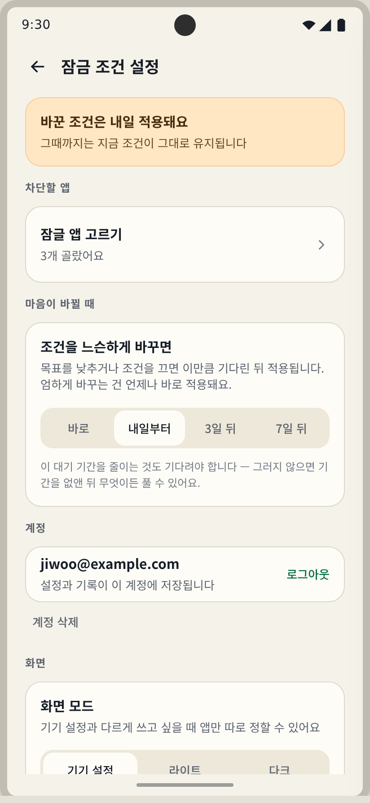
</p>

앱 삭제와 권한 끄기는 여전히 뚫립니다. 막을 방법이 없고, **막아서도 안 되는 안전장치**입니다.

---

## 디자인 시스템

전체 기준은 **[DESIGN.md](DESIGN.md)** 에 정리해 두었습니다 — 색·글자·간격·공통 컴포넌트·
화면 상태 기준과, 코드에서 확인한 값과 새로 제안한 값의 구분까지 담았습니다.
아래는 그중 핵심만 옮긴 것입니다.

### 색상 — OKLCH로 설계, sRGB로 변환

시안은 OKLCH로 정의했고 Compose에서 쓸 수 있도록 sRGB로 변환했습니다.
원본 토큰은 [`Color.kt`](app/src/main/java/com/steplock/app/ui/theme/Color.kt)에 주석으로 남겨
두어 시안과 대조할 수 있습니다.

| 역할 | OKLCH | sRGB |
| --- | --- | --- |
| 배경 | `oklch(96% 0.012 90)` | `#F5F2E9` |
| 서피스 | `oklch(99% 0.006 90)` | `#FDFCF7` |
| 서피스(보조) | `oklch(93% 0.02 90)` | `#EDE8D9` |
| 보더 | `oklch(88% 0.015 90)` | `#DBD7CD` |
| 본문 | `oklch(23% 0.02 260)` | `#171D26` |
| 보조 텍스트 | `oklch(50% 0.02 260)` | `#5D646F` |
| 브랜드(그린) | `oklch(58% 0.13 165)` | `#009267` |
| 브랜드(진한톤) | `oklch(40% 0.115 165)` | `#005A38` |
| 강조(앰버·잠금) | `oklch(70% 0.15 55)` | `#E48233` |
| 다크 모드 배경 | `oklch(18.5% 0.011 165)` | `#0E1411` |
| 다크 모드 서피스 | `oklch(22.5% 0.012 165)` | `#171E1A` |
| 다크 모드 본문 | `oklch(90% 0.008 165)` | `#D9E0DD` |
| 다크 모드 브랜드 | `oklch(68% 0.13 165)` | `#2EB184` |
| 잠금 화면 배경 | `oklch(19% 0.02 260)` | `#0F141D` |
| 잠금 화면 서피스 | `oklch(25% 0.02 260)` | `#1C222B` |
| 잠금 링(앰버) | `oklch(74% 0.125 58)` | `#E59656` |
| 다크 캐릭터(그린) | `oklch(75% 0.14 165)` | `#3CC998` |

- 배경은 순수 흰색·검정 대신 브랜드 색이 은은하게 섞인 **틴티드 뉴트럴**을 씁니다.
- 앱은 **시스템 다크 모드를 따릅니다**(아래 "다크 모드"). 잠금 화면만은 언제나 전용 어두운 색입니다.
- 잠글 앱은 기기에서 읽은 **실제 아이콘**으로 보여 줍니다 — 첫 글자 뱃지로는
  "틱톡"과 "틱톡 라이트"를 구분할 수 없습니다. 소셜 로그인 아이콘만 각 브랜드 색을 유지합니다.

### 다크 모드

<p align="center">
  
  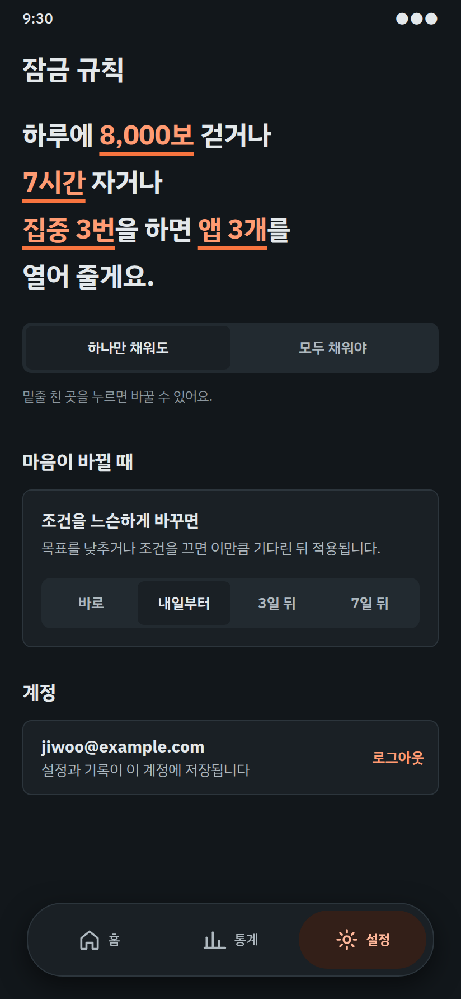
  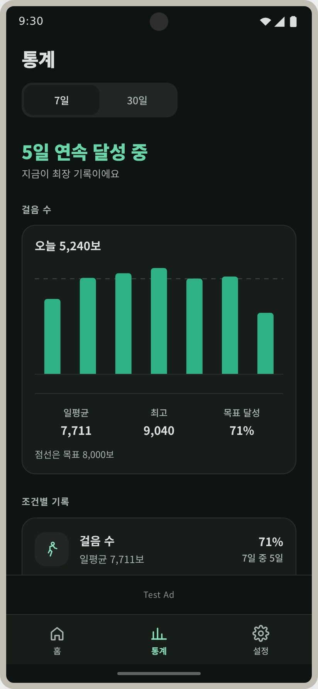
</p>

**설정 → 화면**에서 기기 설정 · 라이트 · 다크를 직접 고를 수 있습니다. 안드로이드 12 이상에서는
시스템에 앱 전용 모드로 등록해(`UiModeManager.setApplicationNightMode`) 스플래시와 창 배경까지
같은 모드를 따르고, 상태 표시줄 아이콘 색도 고른 모드에 맞춥니다.

라이트 값을 뒤집지 않고 역할별로 다시 골랐습니다.

- **면**: 짙은 회색에 브랜드 초록(OKLCH 165) 기운만 아주 살짝. 순수 검정은 쓰지 않습니다.
  면은 밝을수록 앞에 있는 층입니다(배경 18.5% → 패널 22.5% → 보조 면 26.5%) — 어두운
  화면에서는 그림자가 보이지 않아서 밝기로 층을 나눕니다.
- **글자**: 순백 대신 90% 밝기. 어두운 면 위 순백은 번져 보이고 눈이 쉽게 지칩니다(13:1).
  보조 글자도 5.3:1 이상으로 AA를 넘깁니다.
- **브랜드 버튼**: 밝은 초록 위 **어두운 글자**(6.8:1). 흰 글자 초록 버튼은 어두운 배경 속으로
  가라앉습니다.
- **스텝이**: 잠금 화면과 같은 밝은 초록 몸에 어두운 눈. 강조 글자용 밝은 초록을 눈에 쓰면
  눈이 하얗게 뜹니다.

구조는 `SlColor` 이름을 그대로 두고 값만 테마를 따라 바뀌게 했습니다. 색 한 벌(`SlPalette`)을
`StepLockTheme`이 `LocalSlPalette`로 내려 주므로, 화면 코드는 `SlColor.Background`를 예전과
똑같이 씁니다. 창·스플래시 배경은 `values-night`에 두어 켤 때 밝게 번쩍이지 않습니다.

### 타이포그래피

Noto Sans KR 400/500/700/900. 화면에서 쓰는 스타일을 [`Type.kt`](app/src/main/java/com/steplock/app/ui/theme/Type.kt)에
의미 단위로 모아 두고(`SlText.Greeting`, `SlText.RowTitle` …) `includeFontPadding = false`로
시안의 행간을 맞췄습니다. 폰트는 다운로더블 폰트로 받아오며, ttf를 번들하려면
`res/font`에 넣고 `NotoSansKr` 정의만 교체하면 됩니다.

### 간격 · 형태 · 접근성

- 간격은 **4dp 그리드**(4 · 8 · 12 · 16 · 20 · 24 · 28 · 32)만 사용합니다.
- 라운드는 14~20dp, CTA는 16dp, 로그인 버튼과 칩은 캡슐형입니다.
- 카드를 겹치지 않고 하나의 패널 안에서 구분선과 여백으로 섹션을 나눕니다(`SlPanel`).
- 모든 탭 영역은 **44dp 이상**입니다. 스위치·체크박스·텍스트 링크도 시각 크기와 별개로
  터치 영역을 44dp로 확보했습니다.
- 아이콘은 이모지·비트맵 없이 stroke 벡터로 직접 그렸습니다
  ([`SlIcons.kt`](app/src/main/java/com/steplock/app/ui/components/SlIcons.kt)).
- 문구는 동작을 알 수 있게 씁니다 — "손쉬운 사용 권한 허용하기", "알겠어요, 닫기",
  "로그인 없이 둘러보기".
- 한국어 조사 처리: 잠금 화면 제목은 받침에 따라 은/는을 붙입니다("유튜브는", "틱톡은").

---

## 재사용 컴포저블

| 컴포저블 | 설명 |
| --- | --- |
| `ProgressRing` | 홈 44dp · 잠금 176dp 공용 원형 게이지. 홈의 세 조건이 같은 링을 써서 달성 시 숫자 대신 체크가 들어갑니다. |
| `ConditionRow` | 홈의 조건 한 줄. 앞쪽 시각 요소와 뒤쪽 상태를 슬롯으로 받습니다. |
| `ConditionSettingCard` | 토글 + 구분선 + `GoalStepper` 조합. 설정의 조건 카드 3개. |
| `GoalStepper` | −/+ 44dp 버튼과 목표값. 걸음 500보 · 수면 30분 · 세션 1회 단위. |
| `AppListItem` | 앱 뱃지 + 이름/부제 + 상태 슬롯(감지 중 점 / 체크박스). |
| `StatusChip` | 잠금 화면 미니 상태 칩. 달성 / 미달성 2상태. |
| `SlConfirmDialog` | 되돌릴 수 없는 동작의 확인 대화상자. 앱 토큰으로 직접 그렸습니다. |
| `UnderlineTextField` | 밑줄형 입력. 포커스 시 밑줄이 브랜드 그린, 비밀번호는 표시 토글 내장. |
| `SocialLoginButton` | 구글 · 카카오 · 애플 44dp 원형 버튼. |
| `SlSwitch` · `CheckboxMark` | 시안 규격(52×32 트랙, 24dp 체크박스)에 맞춘 선택 컨트롤. |
| `BottomNavBar` | 홈 · 통계 · 설정 탭. 화면에서 띄운 알약, 세 탭 모두 이름 표시, 지금 탭은 연한 초록 알약. |
| `WeeklyBarChart` | 일별 막대 하나에 값 하나. 영점에서 시작하고 목표는 점선으로만 표시합니다. |
| `StepTrack` | 진행률을 링이 아니라 캐릭터의 **위치**로 보여 줍니다. 지나온 길은 실선, 남은 길은 점선. |
| `SlSegmented` | 2~4칸 전환 막대. **보는 범위만** 바꿉니다(통계 기간, 완화 대기) — 화면 이동은 하단 탭바. |
| `SlEmptyState` | 빈 패널 안의 안내. 작은 캐릭터를 함께 두어 고장처럼 보이지 않게 합니다. |
| `SlBannerAd` | 앵커드 어댑티브 배너. **통계 화면에만** 붙입니다. |
| `SlPanel` · `SectionLabel` · `PrimaryButton` · `TextLink` · `IconTile` · `AppBadge` | 공통 레이아웃 조각. |

---

## 로그인

인증은 **Supabase Auth**를 씁니다. 카카오를 기본 프로바이더로 제공하기 때문입니다 —
Firebase Auth는 카카오를 직접 지원하지 않아 커스텀 토큰을 발급할 서버가 따로 필요합니다.

- 이메일/비밀번호 로그인·회원가입이 동작하고, 세션은 Supabase 클라이언트가 복구합니다.
- 구글 · 카카오 · 애플 버튼은 브라우저를 열고 `steplock://login-callback` 딥링크로 돌아옵니다.
  결과는 `sessionStatus` 흐름으로 들어와 이메일 로그인과 같은 경로를 탑니다.
- 로그인되면 `deviceUuid` 레코드에 `accountId`가 붙습니다(계정 귀속). 로그아웃하면 계정 정보만
  지우고 기기 기록은 그대로 둡니다.
- 설정 상단 계정 줄에서 로그인 상태를 보고 로그아웃할 수 있고, 게스트면 같은 자리에서
  `LoginTrigger.Sync` 문구로 로그인 화면을 띄웁니다.

### 배포 전 콘솔 설정

코드가 아니라 콘솔 설정입니다. OAuth 앱은 소유 계정으로 약관에 동의해야 발급되므로 직접 만들어야
합니다. 아래 값만 그대로 붙여 넣으면 됩니다.

양쪽 콘솔에 공통으로 넣는 **콜백 URL**:

```
https://thcchvmwkgfhqqzponnx.supabase.co/auth/v1/callback
```

**1. Supabase — Authentication → URL Configuration**

- Redirect URLs에 `steplock://login-callback` 추가 (앱으로 돌아올 딥링크)
- `OAuth Apps`와 `OAuth Server`는 Supabase를 OAuth 제공자로 쓸 때의 메뉴라 여기선 쓰지 않습니다.

**2. Google — Google Cloud Console → Google 인증 플랫폼**

- 먼저 브랜딩(동의 화면)을 만듭니다: 앱 이름 `스텝락`, 지원 이메일, 대상 **외부(External)**
- 대상이 "테스트" 상태면 **등록한 테스트 사용자만 로그인됩니다** — `대상` 메뉴에서 본인 계정을
  테스트 사용자로 추가하세요. 빠뜨리면 구글 로그인에서 액세스 차단이 뜹니다.
- 클라이언트 → OAuth 클라이언트 ID 만들기 → 애플리케이션 유형 **웹 애플리케이션**
  - Android 유형은 client secret을 발급하지 않습니다. Supabase가 서버에서 코드를 교환하므로
    ID와 secret 한 쌍이 필요하고, 그래서 패키지 이름·SHA-1 지문은 이 방식에서 쓰지 않습니다.
  - 승인된 리디렉션 URI에 위 콜백 URL 추가 (JavaScript 원본은 비워 둡니다)
- 발급된 client ID / client secret → Supabase **Authentication → Sign In / Providers → Google**

**3. Kakao — Kakao Developers → 앱 관리**

- 제품 설정 → **카카오 로그인 → 일반**: 사용 설정 ON, 같은 페이지의 Redirect URI에 위 콜백 URL 추가
  (OpenID Connect는 켜 두어도 무해하지만 필수는 아닙니다)
- 카카오 로그인 → **보안**: Client Secret 코드 생성 후 활성화 ON
- 카카오 로그인 → **동의항목**: 카카오계정(이메일)을 **선택 동의**로 설정.
  필수 동의는 비즈 앱 전환이 필요하고, 사용자가 동의하지 않으면 이메일 없이 계정이 만들어져
  설정 화면의 계정 줄이 비어 보입니다.
- 앱 설정 → **앱 → 앱 키**: `REST API 키` 복사
- Supabase Authentication → Sign In / Providers → Kakao에 **Client ID = REST API 키**,
  **Client Secret = 보안에서 만든 코드** (네이티브 앱 키나 JavaScript 키가 아닙니다)

**4. 이메일 로그인** — Authentication → Sign In / Providers → Email에서 확인 메일 사용 여부를
정합니다. 기본은 켜져 있어 회원가입 후 메일의 링크를 눌러야 로그인됩니다.

`SUPABASE_URL`과 공개 키는 `app/build.gradle.kts`의 `buildConfigField`에 있습니다. 공개 키는
클라이언트에 노출되도록 설계된 값이라 저장소에 함께 둡니다 — 데이터 보호는 RLS로 합니다.

---

## 서버 동기화

로그인한 계정의 설정과 일별 기록을 Supabase Postgres와 맞춥니다
([`SyncRepository.kt`](app/src/main/java/com/steplock/app/data/SyncRepository.kt)).
로그인 직후와 홈 화면으로 돌아올 때 실행되고, 게스트면 아무것도 하지 않습니다.

| 테이블 | 키 | 내용 |
| --- | --- | --- |
| `lock_settings` | `user_id` | 목표값·조건 토글·차단 앱·기기 UUID·`updated_at` |
| `daily_stats` | `user_id` + `stat_date` | 날짜별 걸음·수면 분·완료 세션 |

두 테이블 모두 RLS를 켜고 `auth.uid() = user_id` 정책만 둡니다 — 남의 행은 조회도 수정도
되지 않습니다. 그래서 공개 키를 앱에 넣어도 안전합니다. 스키마는
[`supabase/migrations/`](supabase/migrations)에 있어 다른 프로젝트에도 그대로 적용할 수 있습니다.

**충돌 처리**

- 설정은 `updated_at`이 최신인 쪽이 **통째로** 이깁니다. 항목별 병합은 하지 않습니다 —
  "이 기기에서 목표를 8천으로 바꿨다"가 부분 병합으로 뒤섞이는 것보다 예측 가능합니다.
  로컬 시각은 설정을 바꿀 때마다 DataStore에 기록됩니다.
- 일별 기록은 로컬 것을 업서트한 뒤 **원격에만 있는 날짜만** 로컬로 채웁니다. 같은 날짜가
  양쪽에 있으면 로컬이 정답입니다(센서·타이머가 도는 기기가 진실에 가깝다는 전제).

기기 두 대를 동시에 쓰는 경우까지 정확히 맞추려면 항목별 타임스탬프나 서버 측 병합 함수가
필요합니다. 지금은 한 대를 쓰다 기기를 바꾸는 경로를 기준으로 만들었습니다.

---

## 데이터 · 상태 설계

로그인 전에도 기기별로 기록이 쌓이고, 로그인 후 서버 계정에 귀속시킬 수 있도록 모델을 잡았습니다
([`Models.kt`](app/src/main/java/com/steplock/app/data/Models.kt)).

- `LockSettings` · `DailyStat` — `deviceUuid: String`과 `accountId: String?`를 함께 보관.
  로그인 성공 시 `deviceUuid` 레코드를 계정에 귀속(claim)시키는 마이그레이션 훅용입니다.
- `AuthState` — `Unknown` · `Guest` · `SignedIn(accountId)`.
- `SettingsRepository` — DataStore Preferences에 목표값·조건 토글·차단 앱·기기 UUID·온보딩 완료
  여부와 걸음 기준점·수면 분·집중 세션을 저장하고 `Flow<AppPreferences>`로 흘려보냅니다.
- `StepTracker` · `SleepRepository` — 센서와 Health Connect에서 오늘의 값을 만듭니다.
- 일별 이력 — 통계용으로 하루 한 줄(`날짜|걸음|수면분|세션`)씩 최근 30일만 DataStore에 남깁니다.
  주·월 단위 집계까지 가면 Room으로 옮기는 게 맞습니다.
- `StepLockViewModel` — 저장된 설정과 센서 걸음 수를 합쳐 `StateFlow<StepLockUiState?>`로 냅니다.
  설정에서 걸음 목표를 바꾸면 홈 게이지와 잠금 화면 문구가 함께 갱신됩니다.

---

## 기술 스택

- Kotlin 2.0 · Jetpack Compose (Material 3) · Navigation Compose
- Supabase Auth + Postgrest (supabase-kt) · DataStore Preferences · SensorManager ·
  Health Connect · UsageStatsManager · 포그라운드 서비스
- Google AdMob (배너 · 리워드) + UMP 동의 관리
- Gradle KTS + 버전 카탈로그 (`gradle/libs.versions.toml`)
- minSdk 26 / targetSdk 35 · edge-to-edge

```
app/src/main/java/com/steplock/app
├── MainActivity.kt
├── ads/             # 동의(UMP) · 리워드 광고 · 배너
├── data/            # 모델 · SettingsRepository(DataStore) · AuthRepository · SyncRepository ·
│                    # StepTracker · SleepRepository · UnlockEvaluator
├── navigation/      # Route · StepLockNavHost
├── service/         # AppWatchService(전경 앱 감시) · PomodoroService(집중 세션)
├── system/          # 권한 확인과 설정 화면 인텐트
└── ui/
    ├── LockActivity.kt
    ├── components/  # 재사용 컴포저블 + stroke 아이콘 세트
    ├── screens/     # 5개 화면
    ├── theme/       # 색 · 타이포 · 치수 토큰
    └── util/        # 숫자·시간·조사 포맷
```

## 실행

```bash
./gradlew assembleDebug
```

Android Studio에서 열면 각 화면의 `@Preview`로 레이아웃을 바로 볼 수 있습니다.

### 폰에 바로 설치하기

빌드 환경 없이 확인하려면 GitHub Actions가 만들어 둔 APK를 받으면 됩니다.
main에 푸시될 때마다 새로 빌드해 같은 주소에 올립니다.

**[steplock-debug.apk 내려받기](https://github.com/kangjungmook/StepLock_App/releases/download/debug/steplock-debug.apk)**

디버그 키로 서명한 테스트 빌드라 "출처를 알 수 없는 앱" 설치를 허용해야 합니다.
설치 후 **사용 정보 접근**과 **다른 앱 위에 표시**를 수동으로 켜야 잠금이 동작합니다.

## 광고

수익화가 앱의 목적을 깎아먹지 않도록, **사용자가 무엇을 하는 중인지**로 자리를
정했습니다. 기준은 [DESIGN.md 7절](DESIGN.md#7-광고-배치-기준-코드)에 있습니다.

| 자리 | 형태 | 조건 |
| --- | --- | --- |
| 통계 화면 하단 | 앵커드 어댑티브 배너 | 기록이 하나라도 있을 때만 |
| 잠금 화면 하단 링크 | 리워드 광고 → 임시 허용 +5분 | 기본 3회를 **다 쓴 뒤에만** |

잠금 화면·집중 타이머·온보딩·홈에는 넣지 않았고, 전면 광고는 아예 쓰지 않습니다.
참거나 집중하는 중인 화면에 광고를 넣으면 앱이 하려는 일을 스스로 방해합니다.

리워드 광고에는 **상한**이 있습니다 — 기본 3회 + 광고 2회 = 하루 최대 5회.
무한히 늘릴 수 있으면 광고만 보면서 잠금을 무력화할 수 있습니다.

식별자는 빌드 타입으로 갈라 둡니다.

| 빌드 | 광고 ID |
| --- | --- |
| 디버그 APK | **언제나 구글 공식 테스트 ID** — 설정과 무관합니다 |
| 릴리스 AAB | `admob.properties`(gitignore)나 환경변수의 실 ID. 하나라도 비면 테스트 ID |

폰에 직접 깔아서 눌러 보는 건 늘 디버그 APK라서, 자기 앱의 실 광고를 눌러 AdMob
계정이 정지되는 사고가 이 구분 덕에 **구조적으로** 막힙니다.

단, **비공개 테스트도 릴리스 빌드**입니다. 그래서 실 ID는 세 개가 **모두** 채워졌을
때만 적용되게 했습니다 — 테스트 기간에는 두 개를 비워 두면 릴리스도 테스트 광고로
빌드되므로, 변수를 넣지 않는 것 자체가 안전장치가 됩니다. 자세한 시점은
[출시 체크리스트 6-1](docs/play-store-checklist.md)에 있습니다.

## 출시 준비

Play 스토어에 올리려면 코드 말고도 필요한 게 많아서 따로 정리해 두었습니다.

- [출시 체크리스트](docs/play-store-checklist.md) — 데이터 보안 양식 답변, `specialUse`
  포그라운드 서비스 설명, Health Connect 선언, 업로드 키 만들기, 남은 준비물
- [개인정보처리방침](docs/privacy-policy.md)
- [계정 및 데이터 삭제 안내](docs/account-deletion.md)

코드 쪽은 계정 삭제(앱 안 경로 + 서버 함수), 릴리스 서명 설정, R8 축소,
AAB 생성까지 준비돼 있습니다. 남은 것은 대부분 콘솔 작업과 심사 서류입니다.

## 구현 범위

동작하는 것 — 아홉 화면(튜토리얼 · 잠글 앱 고르기 포함), 설정 영구 저장, 세 조건 모두(걸음 수 센서 · Health Connect 수면 ·
25분 집중 세션), 차단 앱 감지와 잠금 오버레이, 조건 판정(하나만 / 전부 만족), 임시 허용 5분,
최근 7일 통계, 이메일·소셜 로그인과 비밀번호 재설정 메일, 계정 단위 서버 동기화,
재부팅 후 감시 서비스 자동 복구, 계정·데이터 삭제, AdMob 배너·리워드 광고와 UMP 동의,
설정 완화 대기(기간은 사용자가 선택), 다크 모드(기기 설정 · 라이트 · 다크 직접 선택),
스텝이 말풍선 · 알림(해제 · 저녁 산책 응원), 앱별 오늘 막은 횟수.

아직 연결하지 않은 것:

- **소셜 프로바이더 설정** — 코드는 붙었지만 Supabase 대시보드에서 Google · Kakao OAuth 앱을
  등록해야 실제로 로그인됩니다(위 "로그인" 절 참고).
- **다기기 동시 사용** — 동기화는 기기를 바꾸는 경로 기준입니다(위 "서버 동기화" 절 참고).
- **화면 단위 차단** — 앱 단위로만 잠깁니다(아래 참고).

쇼츠·릴스는 각각 YouTube·Instagram 앱 안에 있어 앱 단위로 잠깁니다.
짧은 영상 화면만 골라 잠그려면 접근성 서비스로 화면 단위를 봐야 합니다.
